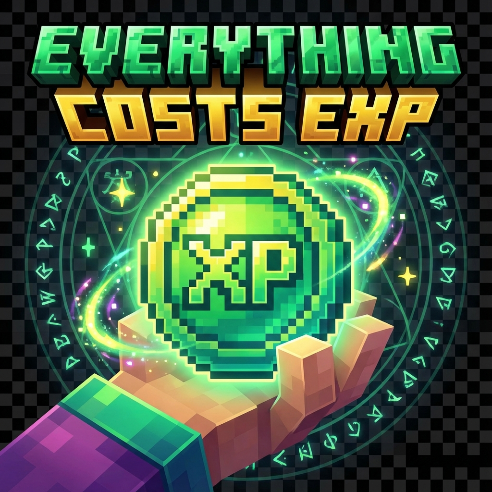

# Everything Costs EXP



**"Spend experience to power your server."**

Everything Costs EXP is a lightweight Spigot plugin that turns XP levels into a currency. Configure almost any action—commands, block breaking, crafting, and more—to cost experience levels.

## Features

- **XP Payment System**: Deduct XP levels for configurable actions.
- **Command Costs**: Charge XP for commands like `/home`, `/tp`, etc.
- **Action Costs**: Charge for anvils, enchanting, crafting, block breaking/placing.
- **Visual Feedback**: Action bar messages, sounds, and title warnings (all toggleable).
- **Permission System**: Bypass permissions for admins or VIPs.
- **Zero Dependencies**: Works out of the box on Spigot 1.21+.

## Installation

1. Download the `EverythingCostsEXP.jar`.
2. Place it in your server's `plugins` folder.
3. Restart your server.
4. Edit `plugins/EverythingCostsEXP/config.yml` to customize costs.
5. Run `/expreload` to apply changes.

## Commands

| Command | Description | Permission |
|---------|-------------|------------|
| `/expcheck` | Show your current XP level and balance. | `exp.pay.check` |
| `/expreload` | Reload the configuration. | `exp.admin` |
| `/expset <player> <level>` | Set a player's XP level. | `exp.admin` |
| `/expadd <player> <amount>` | Add XP levels to a player. | `exp.admin` |

## Permissions

- `exp.pay.*`: Allow all payments (default: true).
- `exp.bypass.*`: Bypass all XP costs (default: op).
- `exp.bypass.command.<command>`: Bypass cost for specific command (e.g., `exp.bypass.command.home`).
- `exp.bypass.action.<action>`: Bypass cost for specific action (e.g., `exp.bypass.action.anvil`).
- `exp.admin`: Access to admin commands (default: op).

## Configuration

### `config.yml`

```yaml
display:
  action-bar: true
  sound: true
  title-warning: false

costs:
  commands:
    home: 10
    back: 20
    tp: 35

  actions:
    anvil: 5
    enchant: 15
    craft-diamond-sword: 30
    
    block-break:
      DIAMOND_ORE: 5
      NETHERITE_BLOCK: 50
      
    block-place:
      TNT: 10
```

### Supported Actions

- **Commands**: Any command (without slash).
- **`anvil`**: Using an anvil (result slot).
- **`enchant`**: Enchanting an item.
- **`craft-<item>`**: Crafting a specific item (e.g., `craft-diamond-sword`).
- **`block-break`**: Breaking blocks (specific materials).
- **`block-place`**: Placing blocks (specific materials).
- **`teleport`**: General teleportation cost (careful with double charging commands).
- **`ender-pearl`**: Using ender pearls.

## Troubleshooting

- **"You don't have enough EXP!"**: The player needs more levels to perform the action.
- **Costs not applying**: Check `config.yml` syntax and ensure you ran `/expreload`.
- **Double charging**: If you set a cost for `/home` AND a cost for `teleport`, both might apply depending on configuration. It's recommended to use specific command costs.

## Support

For issues or feature requests, please open an issue on the GitHub repository.
